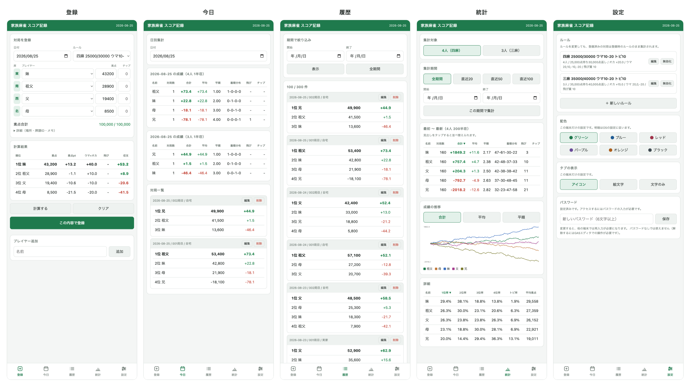

# 家族麻雀 スコア記録

麻雀のスコアを登録・集計する Google Apps Script Web アプリ。
データは Google スプレッドシートに保存され、PC/スマートフォンのブラウザから
URLへアクセスして利用できる。

設計の詳細は [DESIGN.md](DESIGN.md) を参照。



*サンプルデータ（四麻200半荘＋三麻100半荘）を入れた状態。左から 登録・今日・履歴・統計・設定。*

## できること

- **登録** — 1半荘ごとに、席順・素点・チップを入力。素点合計をリアルタイム検証し、
  確定前に順位と収支をプレビュー
- **今日** — その日の対局一覧と、四麻・三麻に分けたプレイヤー別集計
- **履歴** — 期間で絞った対局一覧。誤入力の訂正・削除
- **統計** — 通算成績（対局数・平均順位・着順分布ほか）と、着順ごとの率・トビ率・
  平均素点をまとめた詳細表、成績の推移グラフ。
  **四麻と三麻は分けて集計する**（ウマ・オカ・順位の幅が違うため）。
- **設定** — ルールプリセットの管理。人数（4人/3人）・配給原点・返し点・ウマ・飛び賞を
  それぞれ独立に設定。配色（6色）とタブバーの表示（アイコン/絵文字/文字のみ）の変更（端末ごと）。
- 4人麻雀 / 3人麻雀の両対応。ウマ・オカ・飛び賞・チップに対応
- ルールを変更しても、登録済みの対局は**登録時のルールのまま**集計される
  （対局ごとにルールのスナップショットを保存）
- **パスワードによるアクセス制御**。`setup()` が発行し、初回アクセス時に入力を求める。

## はじめる

自分用に立てて使う場合は **[SETUP.md](SETUP.md)** を参照（カスタマイズ → デプロイ →
パスワード → 更新の手順）。設計の背景と判断の理由は [DESIGN.md](DESIGN.md)。

まず動かしてみるだけなら、Google へのデプロイなしにブラウザで確認できる。

```bash
npm install        # 型定義・TypeScript・clasp のみ。実行時依存なし
npm run dev:bulk   # 上の画像と同じサンプルデータで起動
# → http://localhost:8080
```

| コマンド | 内容 |
|---|---|
| `npm run dev` | 現在のローカルDBのまま起動 |
| `npm run dev:seed` | データが空ならサンプルを投入して起動 |
| `npm run dev:reset` | ローカルDBを作り直して6半荘だけ投入 |
| `npm run dev:bulk` | 5人・四麻200半荘＋三麻100半荘。統計やグラフの確認用 |

対局数は `--games4` / `--games3` で指定できる。乱数は固定シードなので同じ指定なら
同じデータになる。生成の詳細は [DESIGN.md](DESIGN.md) §9 を参照。

ローカルDBは `dev/data/db.json`（Git管理外）。スプレッドシートの行をそのまま配列で
持つので、本番と同じ読み書き経路を通る。`src/` を編集すると次のリクエストで
読み直される。

## テスト

```bash
npm test           # 計算・集計・書き込み無害化・設定・サーバーAPIの78件
npm run test:e2e   # ヘッドレスChromeで実UIを操作する2シナリオ107項目
npm run test:all   # 両方
npm run typecheck  # JSDocベースの型チェック
```

`npm test` は `src/` の実コードを Node に読み込んで検証する（外部ライブラリ不要）。
`npm run test:e2e` は Chrome を自動で探し、見つからなければスキップする
（`CHROME_PATH` で明示指定も可）。

## ディレクトリ構成

```
src/          Apps Script にデプロイされるコード
  Config.js     タイトルなど、自分用に決める設定
  Code.js       doGet / setup（エントリポイント）
  Schema.js     シート定義と値の正規化
  Domain.js     順位・ウマ・オカ・収支の計算（関数）
  Stats.js      集計（関数）
  Store.js      スプレッドシートへの読み書き
  Repo.js       ドメイン単位のCRUD
  Auth.js       パスワードの検証
  Api.js        ブラウザから google.script.run で呼ぶ関数
  index.html / css.html / js.html   画面
  appsscript.json   マニフェスト（公開範囲・タイムゾーン）
dev/          ローカル開発用（デプロイされない）
  local-server.js  ローカルWebサーバー
  app-context.js   src/*.js をNodeに読み込む
  LocalStore.js    Store.js のローカル版（JSONファイル）
  server.js        HTTP層
  deploy.js        push とデプロイ更新をまとめて実行
  calibrate-seed.js   サンプルデータの実力差・分散を実測する
  e2e-script.js       ブラウザ内E2Eシナリオ
  e2e-gate-script.js  パスワード画面のE2Eシナリオ
tests/        テスト
```

## ライセンス

MIT License。詳細は [LICENSE](LICENSE) を参照。
